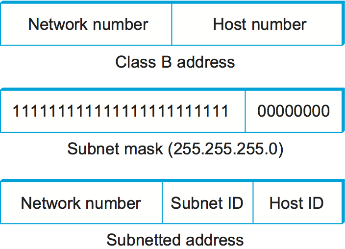
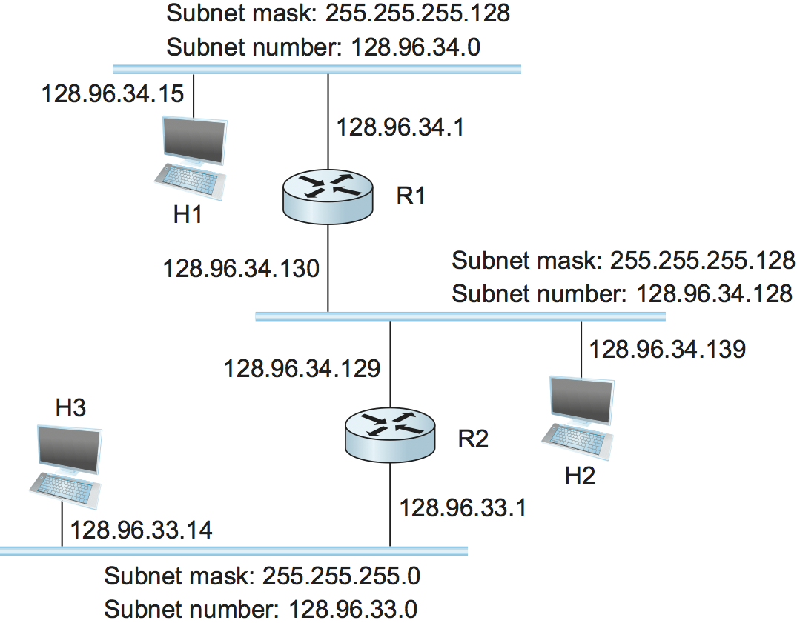
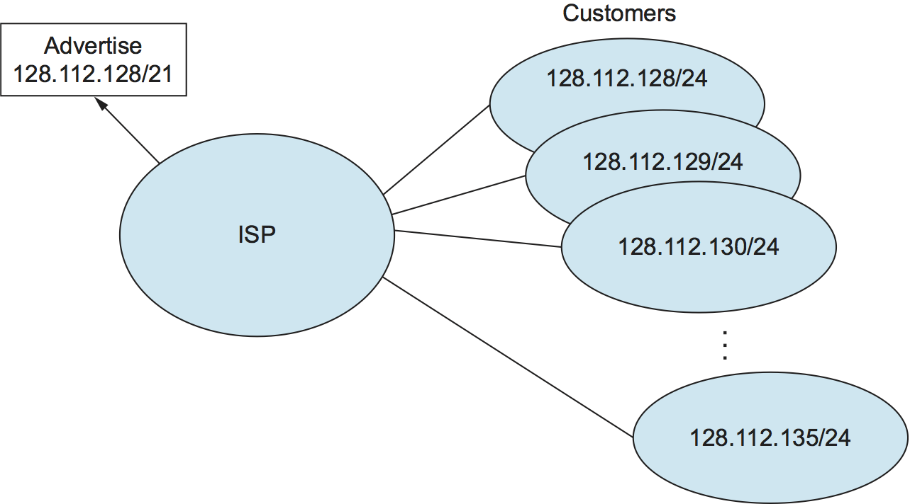

6.3 Scale
-----------

As the Internet has grown in its geographic reach, the number of
networks, and the number of hosts it connects, various aspects of its
design have come under stress. Most notably, the IPv4 address space,
while seemingly capable of addressing 4 billion hosts, was under
pressure long before that many hosts were connected. In this section
we examine the range of techniques that have been applied to enable
the Internet to keep on scaling up.

6.3.1 Subnetting and Classless Addressing
-----------------------------------------

The original "classful" design for IP addresses use the network part
of the address to identify exactly one physical network. It turns out that this
approach has a couple of drawbacks. First is address assignment
efficiency, and the second is routing scalability.

With the original addressing scheme, each
network, no matter how small, needs at least a class C network
address. Even worse, any network with more than 255 hosts needs
a class B address. This may not seem like a big deal, and indeed it
wasn’t when the Internet was first envisioned, but there are only a
finite number of network numbers, and there are far fewer class B
addresses than class Cs. Class B addresses were in particularly
high demand because you never know if your network might expand beyond
255 nodes, so it is easier to use a class B address from the start than
to have to renumber every host when you run out of room on a class C
network. Hence the problem of address assignment inefficiency:
A network with two nodes uses an entire class C network address, thereby
wasting 253 perfectly useful addresses; a class B network with slightly
more than 255 hosts wastes over 64,000 addresses. Keep doing this for
long enough and the 4 billion IP addresses would be used up long before
there are even a billion devices on the Internet.

Now consider the impact on routing. Recall that the amount of state
that is stored in a node participating in a routing protocol is
proportional to the number of other nodes, and that routing in an
internet consists of building up forwarding tables that tell a router
how to reach different networks. Thus, the more network numbers there
are in use, the bigger the forwarding tables get. Big forwarding tables
add costs to routers, and they are potentially slower to construct and
to search than
smaller tables for a given technology, so they degrade router
performance. This provides another motivation for assigning network
numbers carefully.

*Subnetting* provides a first step to tackling both of these problems.
The idea is to take a single IP network
number and allocate the IP addresses with that network number to several
physical networks, which are now referred to as *subnets*. For this to
work, the subnets should be
close to each other. This is because from a distant point in the
Internet, they will all look like a single network, having only one
network number between them. This means that a router will only be able
to select one route to reach any of the subnets, so they had better all
be in the same general direction. A perfect situation in which to use
subnetting is a large campus or corporation that has many physical
networks. From outside the campus, all you need to know to reach any
subnet inside the campus is where the campus connects to the rest of the
Internet. This is often at a single point, so one entry in your
forwarding table will suffice. Even if there are multiple points at
which the campus is connected to the rest of the Internet, knowing how
to get to one point in the campus network is still a good start.

The mechanism by which a single network number can be shared among
multiple networks involves configuring all the nodes on each subnet with
a *subnet mask*. With simple IP addresses, all hosts on the same network
must have the same network number. The subnet mask enables us to
introduce a *subnet number*; all hosts on the same physical network will
have the same subnet number, which means that hosts may be on different
physical networks but share a single network number. This concept is
illustrated in :numref:`Figure %s <fig-subaddr>`.

.. _fig-subaddr:

   Subnet addressing.

What subnetting means to a host is that it is now configured with both
an IP address and a subnet mask for the subnet to which it is
attached.  For example, host H1 in :numref:`Figure %s <fig-subnet>` is
configured with an address of 128.96.34.15 and a subnet mask of
255.255.255.128. (All hosts on a given subnet are configured with the
same mask; that is, there is exactly one subnet mask per subnet.) The
bitwise AND of these two numbers defines the subnet number of the host
and of all other hosts on the same subnet. In this case, 128.96.34.15
AND 255.255.255.128 equals 128.96.34.0, so this is the subnet number
for the topmost subnet in the figure.

.. _fig-subnet:

   An example of subnetting.

When the host wants to send a packet to a certain IP address, the first
thing it does is to perform a bitwise AND between its own subnet mask
and the destination IP address. If the result equals the subnet number
of the sending host, then it knows that the destination host is on the
same subnet and the packet can be delivered directly over the subnet. If
the results are not equal, the packet needs to be sent to a router to be
forwarded to another subnet. For example, if H1 is sending to H2, then
H1 ANDs its subnet mask (255.255.255.128) with the address for H2
(128.96.34.139) to obtain 128.96.34.128. This does not match the subnet
number for H1 (128.96.34.0) so H1 knows that H2 is on a different
subnet. Since H1 cannot deliver the packet to H2 directly over the
subnet, it sends the packet to its default router R1.

The forwarding table of a router also changes slightly when we introduce
subnetting. Recall that we previously had a forwarding table that
consisted of entries of the form ``(NetworkNum, NextHop)``. To support
subnetting, the table must now hold entries of the form
``(SubnetNumber, SubnetMask, NextHop)``. To find the right entry in the
table, the router ANDs the packet’s destination address with the
``SubnetMask``\ for each entry in turn; if the result matches the
``SubnetNumber`` of the entry, then this is the right entry to use, and
it forwards the packet to the next hop router indicated. In the example
network of :numref:`Figure %s <fig-subnet>`, router R1 would have the entries
shown in :numref:`Table %s <tab-subnettab>`.

.. _tab-subnettab:
.. table:: Example Forwarding Table with Subnetting.
   :align: center
   :widths: auto

   +---------------+-----------------+-------------+
   | SubnetNumber  | SubnetMask      | NextHop     |
   +===============+=================+=============+
   | 128.96.34.0   | 255.255.255.128 | Interface 0 |
   +---------------+-----------------+-------------+
   | 128.96.34.128 | 255.255.255.128 | Interface 1 |
   +---------------+-----------------+-------------+
   | 128.96.33.0   | 255.255.255.0   | R2          |
   +---------------+-----------------+-------------+

Continuing with the example of a datagram from H1 being sent to H2, R1
would AND H2’s address (128.96.34.139) with the subnet mask of the first
entry (255.255.255.128) and compare the result (128.96.34.128) with the
network number for that entry (128.96.34.0). Since this is not a match,
it proceeds to the next entry. This time a match does occur, so R1
delivers the datagram to H2 using interface 1, which is the interface
connected to the same network as H2.

We can now describe the datagram forwarding algorithm in the following
way:

::

   D = destination IP address
   for each forwarding table entry (SubnetNumber, SubnetMask, NextHop)
       D1 = SubnetMask & D
       if D1 = SubnetNumber
           if NextHop is an interface
               deliver datagram directly to destination
           else
               deliver datagram to NextHop (a router)

Although not shown in this example, a default route would usually be
included in the table and would be used if no explicit matches were
found. Note that a naive implementation of this algorithm—one involving
repeated ANDing of the destination address with a subnet mask that may
not be different every time, and a linear table search—would be very
inefficient.

An important consequence of subnetting is that different parts of the
internet see the world differently. From outside our hypothetical
campus, routers see a single network. In the example above, routers
outside the campus see the collection of networks in :numref:`Figure
%s <fig-subnet>` as just the network 128.96, and they keep one entry in
their forwarding tables to tell them how to reach it. Routers within the
campus, however, need to be able to route packets to the right subnet.
Thus, not all parts of the internet see exactly the same routing
information. This is an example of an *aggregation* of routing
information, which is fundamental to scaling of the routing system. The
next section shows how aggregation can be taken to another level.

Classless Addressing
~~~~~~~~~~~~~~~~~~~~

Subnetting has a counterpart, sometimes called *supernetting*, but more
often called *Classless Interdomain Routing* or CIDR, pronounced
“cider.” CIDR takes the subnetting idea to its logical conclusion by
essentially doing away with address classes altogether. Why isn’t
subnetting alone sufficient? In essence, subnetting only allows us to
split a classful address among multiple subnets, while CIDR allows us to
coalesce several classful addresses into a single “supernet.” This
further tackles the address space inefficiency noted above, and does so
in a way that keeps the routing system from being overloaded.

To see how the issues of address space efficiency and scalability of the
routing system are coupled, consider the hypothetical case of a company
whose network has 256 hosts on it. That is slightly too many for a Class
C address, so you would be tempted to assign a class B. However, using
up a chunk of address space that could address 65535 to address 256
hosts has an efficiency of only 256/65,535 = 0.39%. Even though
subnetting can help us to assign addresses carefully, it does not get
around the fact that any organization with more than 255 hosts, or an
expectation of eventually having that many, wants a class B address.

The first way you might deal with this issue would be to refuse to give
a class B address to any organization that requests one unless they can
show a need for something close to 64K addresses, and instead giving
them an appropriate number of class C addresses to cover the expected
number of hosts. Since we would now be handing out address space in
chunks of 256 addresses at a time, we could more accurately match the
amount of address space consumed to the size of the organization. For
any organization with at least 256 hosts, we can guarantee an address
utilization of at least 50%, and typically much more. (Sadly, even if
you can justify a request of a class B network number, don’t bother,
because they were all spoken for long ago.)

This solution, however, raises a problem that is at least as serious:
excessive numbers of networks need to be advertised in the routing
protocols. If a single site has, say, 16 class C network numbers
assigned to it, that means every Internet backbone router needs 16
entries in its routing tables to direct packets to that site. This is
true even if the path to every one of those networks is the same. If
we had assigned a class B address to the site, the same routing
information could be stored in one table entry. However, our address
assignment efficiency would then be only 16 x 255 / 65,536 = 6.2%.

CIDR, therefore, balances the need to minimize the number of
routes that are advertised with the need to hand out
addresses efficiently. To do this, CIDR helps us to *aggregate* routes.
That is, it lets us use a single entry in a forwarding table to tell us
how to reach a lot of different networks. It does this by
breaking the rigid boundaries between address classes. To understand how
this works, consider our hypothetical organization with 16 class C
network numbers. Instead of handing out 16 addresses at random, we can
hand out a block of *contiguous* class C addresses. Suppose we assign
the class C network numbers from 192.4.16 through 192.4.31. Observe that
the top 20 bits of all the addresses in this range are the same
(``11000000 00000100 0001``). Thus, what we have effectively created is
a 20-bit network number—something that is between a class B network
number and a class C number in terms of the number of hosts that it can
support. In other words, we get both the high address efficiency of
handing out addresses in chunks smaller than a class B network, and a
single network prefix that can be used for routing. Observe
that, for this scheme to work, we need to hand out blocks of class C
addresses that share a common prefix, which means that each block must
contain a number of class C networks that is a power of two.

CIDR requires a new type of notation to represent network numbers, or
*prefixes* as they are known, because the prefixes can be of any length.
The convention is to place a ``/X`` after the prefix, where ``X`` is the
prefix length in bits. So, for the example above, the 20-bit prefix for
all the networks 192.4.16 through 192.4.31 is represented as
192.4.16/20. By contrast, if we wanted to represent a single class C
network number, which is 24 bits long, we would write it 192.4.16/24.
Today, with CIDR being the norm, it is more common to hear people talk
about “slash 24” prefixes than class C networks. Note that representing
a network address in this way is similar to the\ ``(mask, value)``
approach used in subnetting, as long as ``masks`` consist of contiguous
bits starting from the most significant bit (which in practice is almost
always the case).

.. _fig-cidreg:

   Route aggregation with CIDR.

The ability to aggregate routes at the edge of the network as we have
just seen is only the first step. Imagine an Internet service provider
network, whose primary job is to provide Internet connectivity to a
large number of corporations and campuses (customers). If we assign
prefixes to the customers in such a way that many different customer
networks connected to the provider network share a common, shorter
address prefix, then we can get even greater aggregation of routes.
Consider the example in :numref:`Figure %s <fig-cidreg>`. Assume that eight
customers served by the provider network have each been assigned
adjacent 24-bit network prefixes. Those prefixes all start with the same
21 bits. Since all of the customers are reachable through the same
provider network, it can advertise a single route to all of them by just
advertising the common 21-bit prefix they share. And it can do this even
if not all the 24-bit prefixes have been handed out, as long as the
provider ultimately *will* have the right to hand out those prefixes to
a customer. One way to accomplish that is to assign a portion of address
space to the provider in advance and then to let the network provider
assign addresses from that space to its customers as needed. Note that,
in contrast to this simple example, there is no need for all customer
prefixes to be the same length.

IP Forwarding Revisited
~~~~~~~~~~~~~~~~~~~~~~~

In all our discussion of IP forwarding so far, we have assumed that we
could find the network number in a packet and then look up that number
in a forwarding table. However, now that we have introduced CIDR, we
need to reexamine this assumption. CIDR means that prefixes may be of
any length, from 2 to 32 bits. Furthermore, it is sometimes possible to
have prefixes in the forwarding table that “overlap,” in the sense that
some addresses may match more than one prefix. For example, we might
find both 171.69 (a 16-bit prefix) and 171.69.10 (a 24-bit prefix) in
the forwarding table of a single router. In this case, a packet destined
to, say, 171.69.10.5 clearly matches both prefixes. The rule in this
case is based on the principle of “longest match”; that is, the packet
matches the longest prefix, which would be 171.69.10 in this example. On
the other hand, a packet destined to 171.69.20.5 would match 171.69 and
*not* 171.69.10, and in the absence of any other matching entry in the
routing table 171.69 would be the longest match.

The task of efficiently finding the longest match between an IP address
and the variable-length prefixes in a forwarding table has been a
fruitful field of research for many years. The most well-known algorithm
uses an approach known as a *PATRICIA tree*, which was actually
developed well in advance of CIDR.
