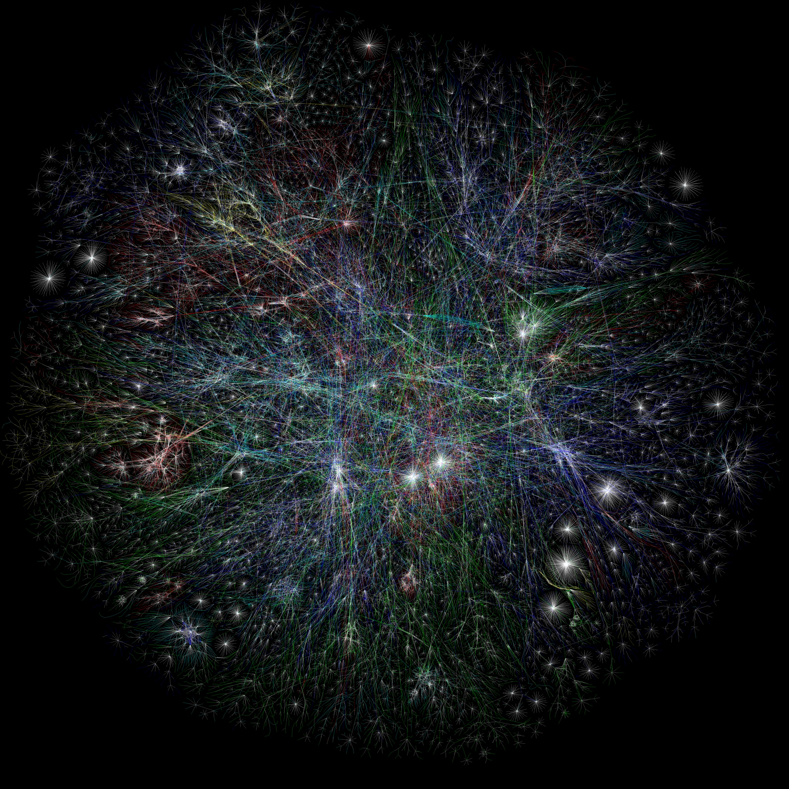

.. SPDX-FileCopyrightText: 2019 Systems Approach LLC
.. SPDX-FileCopyrightText: 2025 Systems Approach LLC
.. SPDX-License-Identifier: CC-BY-4.0

Chapter 1:  Introduction
=============================

Suppose you want to build a computer network, one that has the
potential to grow to global scale and support applications as diverse
as video conferencing, live and on-demand streaming, e-commerce,
social media, automated manufacturing, and more. What available
technologies would serve as the underlying building blocks, and what
kind of software architecture would you design to integrate these
building blocks into an effective communication service? Answering
this question is the overriding goal of this book—to describe the
available building materials and then to show how they can be used to
construct a network from the ground up. Of course the Internet is just
such a network, and so we use the it as our model.

Today's Internet connects over 22 billion devices. Those devices are
widely distributed across the planet (and in low orbit around the
planet), where any one of them can send and receive messages with one
or more of the other 22 billion devices. The network itself is a
massively distributed system, built from hundreds of millions of
switching devices. The system is so complex that visualizations of
data collected about Internet connectivity—like the one shown in
:numref:`Figure %s <fig-net-visualization>`\ —look more like
abstract pieces of art than an engineering diagram.

.. _fig-net-visualization:

   Visualization of Internet connectivity, with attribution to
   Barrett Lyon / The Opte Project.

Understanding a system of this scale and complexity requires more than
reading a set of specifications. There are just too many details,
making it impossible to see the forest for the trees. The key is to
start with a sound framework for understanding the problem space,
identifying the fundamental challenges that have to be addressed, and
exploring the design space of possible solutions. That is the goal of
this book.

It's also important to keep in mind that the path from conception to
today’s reality is not a straight line, nor is today’s Internet the
end of the process. There have been many false starts and stop-gap
solutions, followed by years of iterative improvement. This evolution
culminates in today’s software and hardware artifacts—many of which
are worth looking at in detail—but always keeping in mind that those
too will likely change over time.

.. include:: introduction/requirements.rst
.. include:: introduction/architecture.rst
.. include:: introduction/protocols.rst
.. include:: introduction/statmux.rst
.. include:: introduction/performance.rst
