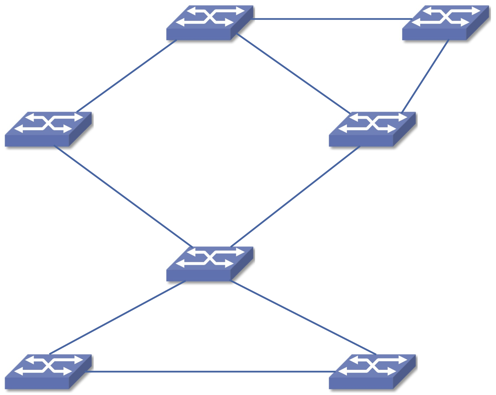

1.2  Network Architecture
---------------------------

The previous section established a substantial set of requirements for
network design—a computer network must provide general,
cost-effective, fair, and robust connectivity among a large number of
computers. As if this weren’t enough, networks do not remain fixed at
any single point in time but must evolve to accommodate changes in
both the underlying technologies upon which they are based as well as
changes in the demands placed on them by application programs.
Furthermore, networks must be manageable by humans of varying levels
of skill. Designing a network to meet these requirements is no
small task.

To help deal with this complexity, network designers often develop a
blueprint—sometimes called a *network architecture*—that guides the
design and implementation of the network. One way to think about a
network architecture is that it specifies a way to modularize the
network; a particular deconstruction of the overall system into a
collection of components. Modularization, in turn, is essentially an
exercise in defining abstractions—identifying the behavior of some
important aspect of the system, encapsulating that behavior in an
object that provides an interface that can be manipulated by other
components of the system, and hiding the details of how the object is
implemented from the users of the object.

Architectures are *not* programs. They sketch a mental model
(typically expressed in words and diagrams), of what actually runs in
the network.  Their purpose is to both *prescribe* how the network
should be implemented (with the goal of guiding engineers in the
actual code that gets written) and *describe* how the network has been
implemented (with the goal of helping developers and operators
understand how the existing network behaves).

This section begins to explain the role of a network architecture by
introducing two of the most widely referenced examples—the OSI (or
7-layer) architecture and the Internet architecture. Because we're
just getting started, the description is intentionally high level, and
we do not attempt to justify either architecture as "the right
answer."  They are just two examples that illustrate how one might
break the a problem of building a network into manageable subsystems.
We conclude this section by introducing the "architecture" this book
uses cover all the important topics in networking.

1.2.1 OSI Model
~~~~~~~~~~~~~~~~~~~~~~~~~~~~~~

The International Standards Organization (ISO) was one of the first
organizations to formally define a common way to connect computers.
Their architecture, called the *Open Systems Interconnection* (OSI)
architecture and illustrated in :numref:`Figure %s <fig-osi>`, defines
a partitioning of network functionality into seven layers, where one
or more components implement the functionality assigned to a given
layer. It is often referred to as the 7-layer model, and while there are
no OSI-based networks running today, the terminology it defined is
still widely used.

.. _fig-osi:
.. figure:: introduction/figures/f01-13-9780123850591.png
   :width: 600px
   :align: center

   The OSI 7-layer model.

Starting at the bottom and working up, the *physical* layer handles
the transmission of raw bits over a communications link. The *data
link* layer then collects a stream of bits into a larger aggregate
called a *frame*. Network adaptors, along with device drivers running
in the node’s operating system, typically implement the data link
level. This means that frames, not raw bits, are actually delivered to
hosts. The *network* layer handles routing among nodes within a
packet-switched network. At this layer, the unit of data exchanged
among nodes is typically called a *packet* rather than a frame,
although they are fundamentally the same thing. The lower three layers
are implemented on all network nodes, including switches within the
network and hosts connected to the exterior of the network. The
*transport* layer then implements what we sometimes refer to as a
*process-to-process channel*. Here, the unit of data exchanged is
commonly called a *message* rather than a packet or a frame. The
transport layer and higher layers typically run only on the end hosts
and not on the intermediate switches or routers.

Skipping ahead to the top (seventh) layer and working our way back
down, we find the *application* layer. Application layer protocols
include things like the Hypertext Transfer Protocol (HTTP), which is
the basis of the World Wide Web and is what enables web browsers to
request pages from web servers. Below that, the *presentation* layer
is concerned with the format of data exchanged between peers—for
example, whether an integer is 16, 32, or 64 bits long, or how an
image or video stream is formatted. Finally, the *session* layer
provides a name space that is used to tie together the potentially
different transport streams that are part of a single application. For
example, it might manage an audio stream and a video stream that are
being combined in a teleconferencing application.

1.2.2 Internet Architecture
~~~~~~~~~~~~~~~~~~~~~~~~~~~~~~

The Internet architecture is less abstract than the OSI architecture
because it is organized around specific components, namely, the TCP
and IP protocols. (For now, think of "protocol" as a synonym for
"component" or "module"; we describe protocols in more detail in the
next section.) The Internet already existed when the OSI architecture
was defined, and the experience gained from building it was a major
influence on the OSI reference model.

.. _fig-internet:
.. figure:: introduction/figures/internet.png
   :width: 350px
   :align: center

   Abstract depiction of the Internet architecture. It's general shape
   is similar to an hourglass: wide at the top (representing many
   applications) and wide at the bottom (representing many network
   technologies), with a narrow waist in the middle (corresponding to
   IP).

The Internet architecture is often depicted by a diagram similar to
the one shown in :numref:`Figure %s <fig-internet>`. The diagram is
noteworthy because of it's hourglass shape—wide at the top, narrow in
the middle, and wide at the bottom. This shape actually reflects an
important design philosophy of the Internet. IP serves as the
focal point for the architecture—it defines a common method for
exchanging packets among a wide collection of networks. Above IP there
can be arbitrarily many application programs (which the diagram
denotes as App\ :sub:`A` to App\ :sub:`Z`) and below IP the
architecture allows for arbitrarily many different network
technologies (which the diagram denotes as Net\ :sub:`1` to Net\
:sub:`N`). In practice, the applications can be anything from web
browsing to video streaming, while popular network technologies
include Ethernet, WiFi, and 5G.

The intermediate layer sitting between IP and the applications, which
typically includes TCP and UDP but could include other protocols,
corresponds to the transport protocols that provide useful services to
application programs. As a rough analogy, you can think of these
protocols as similar to library programs; applications could run
directly on top of IP, but these protocols provide useful
functionality that makes the app developer's job easier.

Most people who work actively in the networking field are familiar
with both the Internet architecture and the 7-layer OSI architecture,
and there is general agreement on how the layers map between
architectures.  The Internet’s application layer is considered to be
at layer 7, its transport layer is layer 4, the IP (internetworking or
just network) layer is layer 3, and the link technologies sitting
below IP correspond to layer 2.

.. sidebar:: IETF and Standardization

   We have informally been talking about the Internet community, but
   it includes a standardization body, known as the
   Internet Engineering Task Force (IETF), which is responsible for
   the specification of many of the Internet protocols, such as TCP,
   UDP, IP, DNS, and BGP. The Internet architecture also embraces
   protocols defined by other organizations, including IEEE's 802.11
   ethernet and Wi-Fi standards, W3C's HTTP/HTML web specifications,
   3GPP's 4G and 5G cellular networks standards, and ITU-T's H.232
   video encoding standards, to name a few.

   In addition to defining architectures and specifying protocols,
   there are yet other organizations that support the larger goal of
   interoperability. One example is the IANA (Internet Assigned
   Numbers Authority), which as its name implies, is responsible for
   handing out the unique identifiers needed to make the protocols
   work. IANA, in turn, is a department within the ICANN (Internet
   Corporation for Assigned Names and Numbers), a non-profit
   organization that's responsible for the overall stewardship of the
   Internet.

Finally, it is worth noting that the Internet had been operational for
well over a decade before anyone started publishing architectural
diagrams like the one shown in :numref:`Figure %s <fig-internet>`.
This is consistent with the Internet's philosophy of implementing and
evaluating new ideas before attempting to standardize them. The
hourglass design was not widely acknowledged until it was well
established as viable, in the same way individual protocols are not
standardized unless there is at least one (and preferably two)
representative implementations. This cultural assumption of the IETF
helps to ensure that the architecture’s protocols can be efficiently
implemented.  Perhaps the value the Internet culture places on working
software is best exemplified by a quote on T-shirts commonly worn at
IETF meetings:

   *We reject kings, presidents, and voting. We believe in rough
   consensus and running code.* **(David Clark)**

1.2.3 Book Architecture
~~~~~~~~~~~~~~~~~~~~~~~~~~~~~~~~~

Like an architecture that imposes structure on a complex system, this
book is organized around a structure that helps us navigate all the
relevant topics. The structure is inspired by the Internet, and begins
by breaking the problem into two parts:

* *Part One: Inside the Network*
* *Part Two: Edge of the Network*

Topics in both parts are central to networking, but making the
division explicit serves to highlight an important system design
principle: the separation of concerns. Fully appreciating the
implications of this principle comes with reading the whole book, but
the gist is straightforward: when faced with the design of a complex
system, carving out independent challenges and addressing them in
isolation, without being overly concerned about how you’re going to
address the other issues, is a proven strategy. Conflating too many
issues and trying to address them all at once is often tempting (it’s
easy to convince yourself that doing so yields a more optimized
solution), but most of the time it’s a recipe for failure.

Of course knowing how to break a complex problem into smaller
subproblems takes experience, but this first cut—inside-vs-edge—has
proved to be an important factor in the Internet’s success. We’ll
explain how to draw the line between the two halves in the
introduction to each Part, with the subsequent chapters tackling the
set of the issues that arises when building that part of the
whole. The rest of this introductory chapter introduces some
network-specific terminology that is used throughout the book. The
terminology has familiar counterparts in other systems, such as
Operating Systems, but networking has its own peculiar way of talking
about certain topics.  Like any deconstruction of a complex system
into separate parts, this decomposition is not perfect. This
particular boundary is important to the Internet’s success, and also
helps us organize the material in this book. But there are important
challenges that require attention, and yet fall outside this
particular framing of the problem space. We call attention to such
“exceptions to the rule” when they arise, and use them to illustrate
that every system design requires judgement and makes tradeoffs.

Inside the Network
^^^^^^^^^^^^^^^^^^^^^^^^

As reported in the Introduction to this chapter, the Internet connects
over 22 billion devices. Clearly, any network that connects that many
devices must itself also be highly distributed, and the Internet is
just such a distributed system. It is built from special devices known
as switches. Each switch has a modest set of communication ports
connected to some link technology, and its job is to receive data on
one port and send it out on another port. This means a distributed
collection of switches can be interconnected to form a network, as
shown in :numref:`Figure %s <fig-network>`. Of course that diagram is
a simplification; the Internet is built from hundreds of millions of
such switches.

.. _fig-network:

   Schematic of an example packet switch network.

Throughout the history of computer networks, there have been many
different kinds of switches. We begin Part One in Chapter 2, where we
look at the possible design space for switches, but settle on a
particular design that plays an important role in today’s Internet:
Ethernet switches. The rest of Part One then builds on top of this
foundation, introducing all the challenges that have to be addressed
in order to send and receive messages over a global network of
interconnected switches inside the network. We assume the 22 billion
devices at the edge of the network are trying to communicate with each
other, but save the challenges of building applications on top of the
interconnected network of switches for Part Two. Our goal in Part One
is to provide logical connectivity between every pair of connected
edge devices.

We say “logical connectivity” because it’s obviously the case that
there is no direct physical connection—say, a fiber optic or copper
cable—between all of those edge 22 billion devices; nearly all
communication is indirect through a sequence of one or more
switches. Moreover, in the same way a physical connection might fail
from time-to-time—a network’s natural enemy is a backhoe that cuts
through a cable, but there are many other more subtle failure
modes—the end-to-end logical connection does not guarantee every sent
message is actually received. Our goal for Part One is to support what
is commonly known as *best-effort packet delivery*, where dealing with
this imperfection is one of the factors that makes Part Two
interesting. In short, you can read Parts One and Two in either order,
knowing that the “interface” between the two halves is a universal,
best-effort packet delivery service.

Edge of the Network
^^^^^^^^^^^^^^^^^^^^^^^^

The edge devices connected to a network like the Internet—whether they
are servers, laptops, mobile phones, or other consumer appliances—are
not managed as part of the network, per se, but they do play a
critical role in realizing a global network like today’s Internet. The
edge is where applications run, along with a networking software stack
that interacts with (connects the device to) the switches running
inside the network. Part Two focuses on the applications and this edge
software stack.

Because software is pliable, and different applications have different
requirements, this edge software stack is much less rigidly defined.
There are different ways to modularize it, and over the history of the
Internet, it has seen substantial change. The edge is where most
innovation occurs, which is another key to the Internet’s success. On
the other hand, there is a benefit for edge devices and their
applications to share some common components, and so we focus our
attention on the edge modules that provide the most value to the most
use cases. As in Part One, the following chapters both explore the
design space and drill down on the artifacts that are in widespread
use today.

We begin Part Two with Chapter 10, where we introduce a representative
set of applications, and identify both how they differ and what they
have in common. Based on what we know about the underlying
network—that it provides the universal, best-effort packet delivery
service described in Part One—the subsequent chapters then discuss the
key challenges that arise when you try to “fill the gap” between what
applications expect and what the underlying packet delivery service
provides.
