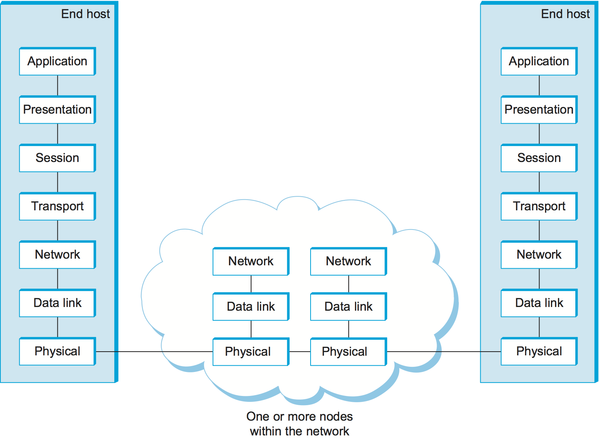
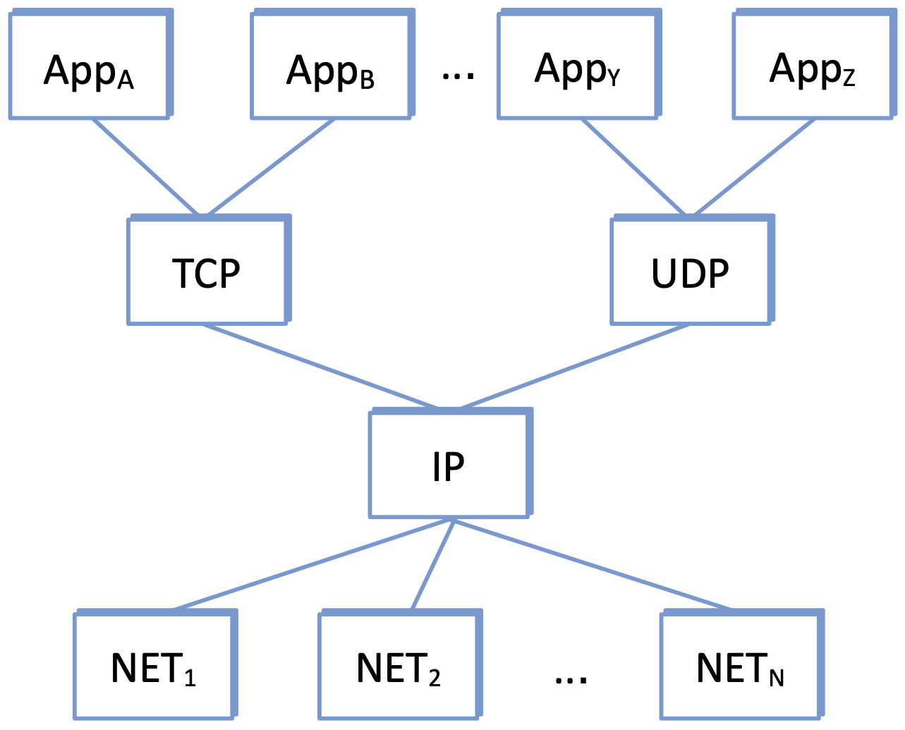

1.2  Network Architecture
---------------------------

The previous section established a substantial set of requirements for
network design—a computer network must provide general,
cost-effective, fair, and robust connectivity among a large number of
computers. As if this weren’t enough, networks do not remain fixed at
any single point in time but must evolve to accommodate changes in
both the underlying technologies upon which they are based as well as
changes in the demands placed on them by application programs.
Furthermore, networks must be manageable by humans of varying levels
of skill. Designing a network to meet these requirements is no
small task.

To help deal with this complexity, network designers often develop
blueprints—sometimes called *network architectures*—that guide the
design and implementation of the network. Network architectures are
multifaceted, but at its core, an architecture defines a particular
way to modularize the network; managing complexity by breaking the
overall system down into collection of components. Modularization, in
turn, is essentially an exercise in defining abstractions—identifying
the behavior of some important aspect of the system, encapsulating
that behavior in an object that provides an interface that can be
manipulated by other components of the system, and hiding the details
of how the object is implemented from the users of the object.

Architectures are *not* programs. They are abstract representations or
models (i.e., words and diagrams) of what actually runs in the
network.  Their purpose is to both *prescribe* how the network should
be implemented (with the goal of guiding engineers in the actual code
that gets written) and *describe* how the network has been implemented
(with the goal of helping developers and operators understand how the
existing network behaves).

This section begins to explain the role of a network architecture by
introducing two of the most widely referenced examples—the OSI (or
7-layer) architecture and the Internet architecture. Because we're
just getting started, the description is intentionally high level, and
we do not attempt to justify either architecture as "the right
answer."  They are just two examples that illustrate how one might
break the a problem of building a network into manageable subsystems.

1.2.1 OSI Model
~~~~~~~~~~~~~~~~~~~~~~~~~~~~~~

The International Standards Organization (ISO) was one of the first
organizations to formally define a common way to connect computers.
Their architecture, called the *Open Systems Interconnection* (OSI)
architecture and illustrated in :numref:`Figure %s <fig-osi>`, defines
a partitioning of network functionality into seven layers, where one
or more components implement the functionality assigned to a given
layer. It is often referred to as the 7-layer model, and while there are
no OSI-based networks running today, the terminology it defined is
still widely used.

.. _fig-osi:

   The OSI 7-layer model.

Starting at the bottom and working up, the *physical* layer handles the
transmission of raw bits over a communications link. The *data link*
layer then collects a stream of bits into a larger aggregate called a
*frame*. Network adaptors, along with device drivers running in the
node’s operating system, typically implement the data link level. This
means that frames, not raw bits, are actually delivered to hosts. The
*network* layer handles routing among nodes within a packet-switched
network. At this layer, the unit of data exchanged among nodes is
typically called a *packet* rather than a frame, although they are
fundamentally the same thing. The lower three layers are implemented on
all network nodes, including switches within the network and hosts
connected to the exterior of the network. The *transport* layer then
implements what we have up to this point been calling a
*process-to-process channel*. Here, the unit of data exchanged is
commonly called a *message* rather than a packet or a frame. The
transport layer and higher layers typically run only on the end hosts
and not on the intermediate switches or routers.

Skipping ahead to the top (seventh) layer and working our way back
down, we find the *application* layer. Application layer protocols
include things like the Hypertext Transfer Protocol (HTTP), which is
the basis of the World Wide Web and is what enables web browsers to
request pages from web servers. Below that, the *presentation* layer
is concerned with the format of data exchanged between peers—for
example, whether an integer is 16, 32, or 64 bits long, or how an
image or video stream is formatted. Finally, the *session* layer
provides a name space that is used to tie together the potentially
different transport streams that are part of a single application. For
example, it might manage an audio stream and a video stream that are
being combined in a teleconferencing application.

1.2.2 Internet Architecture
~~~~~~~~~~~~~~~~~~~~~~~~~~~~~~

The Internet architecture depicted in :numref:`Figure %s
<fig-internet>`, is less abstract than the OSI architecture because it
is organized around the actual components being implemented and
deployed, namely, the TCP and IP protocols. For this reason, the
Internet architecture also sometimes called the TCP/IP architecture.
(For now, think of "protocol" as a synonym for "component" or
"module"; we describe protocols in more detail in the next section.)

The Internet architecture evolved out of experiences with an earlier
packet-switched network called the ARPANET. Both the Internet and the
ARPANET were funded by the Advanced Research Projects Agency (ARPA),
one of the research and development funding agencies of the
U.S. Department of Defense. The Internet and ARPANET were around
before the OSI architecture, and the experience gained from building
them was a major influence on the OSI reference model.

.. _fig-internet:

   Abstract depiction of the Internet architecture. It's general shape
   is similar to an hourglass: wide at the top (representing many
   applications) and wide at the bottom (representing many network
   technologies), with a narrow waist in the middle (corresponding to
   IP).

While the 7-layer OSI model can, with some imagination, be applied to
the Internet, a simpler stack is often used instead. At the lowest
level is a wide variety of network technologies, denoted NET\
:sub:`1`, NET\ :sub:`2`, and so on. In practice, these networks are
implemented by a combination of hardware (e.g., a network adaptor) and
software (e.g., a network device driver). For example, you might find
Ethernet or wireless protocols (such as the 802.11 Wi-Fi standards) at
this layer. (These protocols in turn may actually involve several
sublayers, but the Internet architecture does not presume anything
about them.) The next layer consists of a single protocol—the
*Internet Protocol* (IP). This is the protocol that supports the
interconnection of multiple networking technologies into a single,
logical internetwork. The layer on top of IP contains two main
protocols—the *Transmission Control Protocol* (TCP) and the *User
Datagram Protocol* (UDP). TCP and UDP provide alternative logical
channels to application programs: TCP provides a reliable byte-stream
channel, and UDP provides an unreliable datagram delivery channel
(*datagram* may be thought of as a synonym for message). In the
language of the Internet, TCP and UDP are sometimes called
*end-to-end* protocols, although it is equally correct to refer to
them as *transport* protocols.

Running above the transport layer is a range of application protocols,
such as HTTP, FTP, Telnet (remote login), and the Simple Mail Transfer
Protocol (SMTP), that enable the interoperation of popular applications.
To understand the difference between an application layer protocol and
an application, think of all the different World Wide Web browsers that
are or have been available (e.g., Firefox, Chrome, Safari, Netscape,
Mosaic, Internet Explorer). There is a similarly large number of
different implementations of web servers. The reason that you can use
any one of these application programs to access a particular site on the
Web is that they all conform to the same application layer protocol:
HTTP. Confusingly, the same term sometimes applies to both an
application and the application layer protocol that it uses (e.g., FTP
is often used as the name of an application that implements the FTP
protocol).

Most people who work actively in the networking field are familiar with
both the Internet architecture and the 7-layer OSI architecture, and
there is general agreement on how the layers map between architectures.
The Internet’s application layer is considered to be at layer 7, its
transport layer is layer 4, the IP (internetworking or just network)
layer is layer 3, and the link or subnet layer below IP is layer 2.

.. sidebar:: IETF and Standardization

   Although we call it the "Internet architecture" rather than the
   "IETF architecture," it's fair to say that the IETF is the primary
   standardization body responsible for its definition, as well as the
   specification of many of its protocols, such as TCP, UDP, IP,
   DNS, and BGP. But the Internet architecture also embraces many
   protocols defined by other organizations, including IEEE's
   802.11 ethernet and Wi-Fi standards, W3C's HTTP/HTML web
   specifications, 3GPP's 4G and 5G cellular networks standards,
   and ITU-T's H.232 video encoding standards, to name a few.

   In addition to defining architectures and specifying protocols,
   there are yet other organizations that support the larger goal of
   interoperability. One example is the IANA (Internet Assigned
   Numbers Authority), which as its name implies, is responsible for
   handing out the unique identifiers needed to make the protocols
   work. IANA, in turn, is a department within the ICANN (Internet
   Corporation for Assigned Names and Numbers), a non-profit
   organization that's responsible for the overall stewardship of the
   Internet.

The Internet architecture has three features that are worth
highlighting. First, although not suggested by :numref:`Figure %s
<fig-internet>`, the Internet architecture does not require strict
layering. The application is free to bypass the defined transport
layers and to directly use IP or one of the underlying networks. In
fact, programmers are free to define new channel abstractions or
applications that run on top of any of the existing protocols.

Second, if you look closely at the protocol graph in :numref:`Figure
%s <fig-internet>`, you will notice an hourglass shape—wide at the top,
narrow in the middle, and wide at the bottom. This shape actually
reflects the central philosophy of the architecture. That is, IP serves
as the focal point for the architecture—it defines a common method for
exchanging packets among a wide collection of networks. Above IP there
can be arbitrarily many transport protocols, each offering a different
channel abstraction to application programs. Thus, the issue of
delivering messages from host to host is completely separated from the
issue of providing a useful process-to-process communication service.
Below IP, the architecture allows for arbitrarily many different network
technologies, ranging from Ethernet to wireless to single point-to-point
links.

A final attribute of the Internet architecture (or more accurately, of
the IETF culture) is that in order for a new protocol to be officially
included in the architecture, there must be both a protocol
specification and at least one (and preferably two) representative
implementations of the specification. The existence of working
implementations is required for standards to be adopted by the
IETF. This cultural assumption of the design community helps to ensure
that the architecture’s protocols can be efficiently implemented.
Perhaps the value the Internet culture places on working software is
best exemplified by a quote on T-shirts commonly worn at IETF
meetings:

   *We reject kings, presidents, and voting. We believe in rough
   consensus and running code.* **(David Clark)**

.. _key-hourglass:
.. admonition:: Key Takeaway

   Of these three attributes of the Internet architecture, the hourglass
   design philosophy is important enough to bear repeating. The
   hourglass’s narrow waist represents a minimal and carefully chosen
   set of global capabilities that allows both higher-level applications
   and lower-level communication technologies to coexist, share
   capabilities, and evolve rapidly. The narrow-waisted model is
   critical to the Internet’s ability to adapt to new user
   demands and changing technologies.

