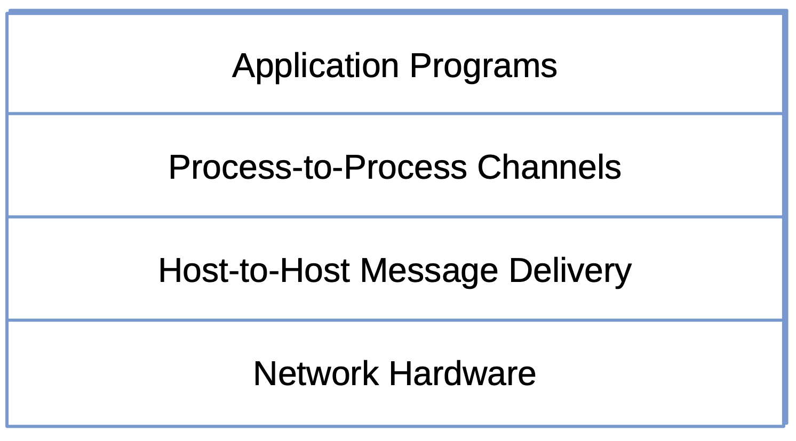
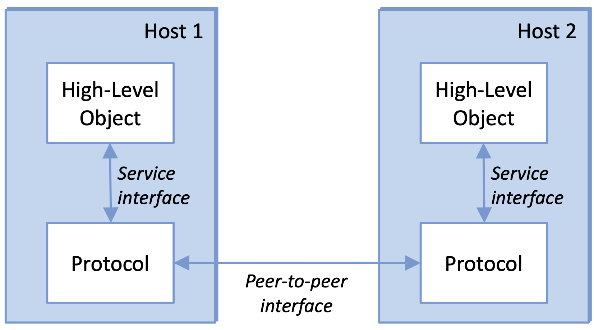
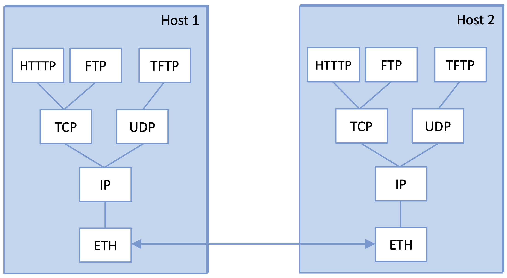
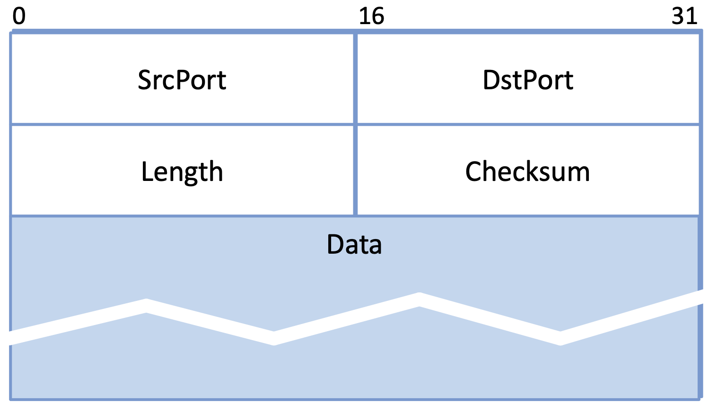
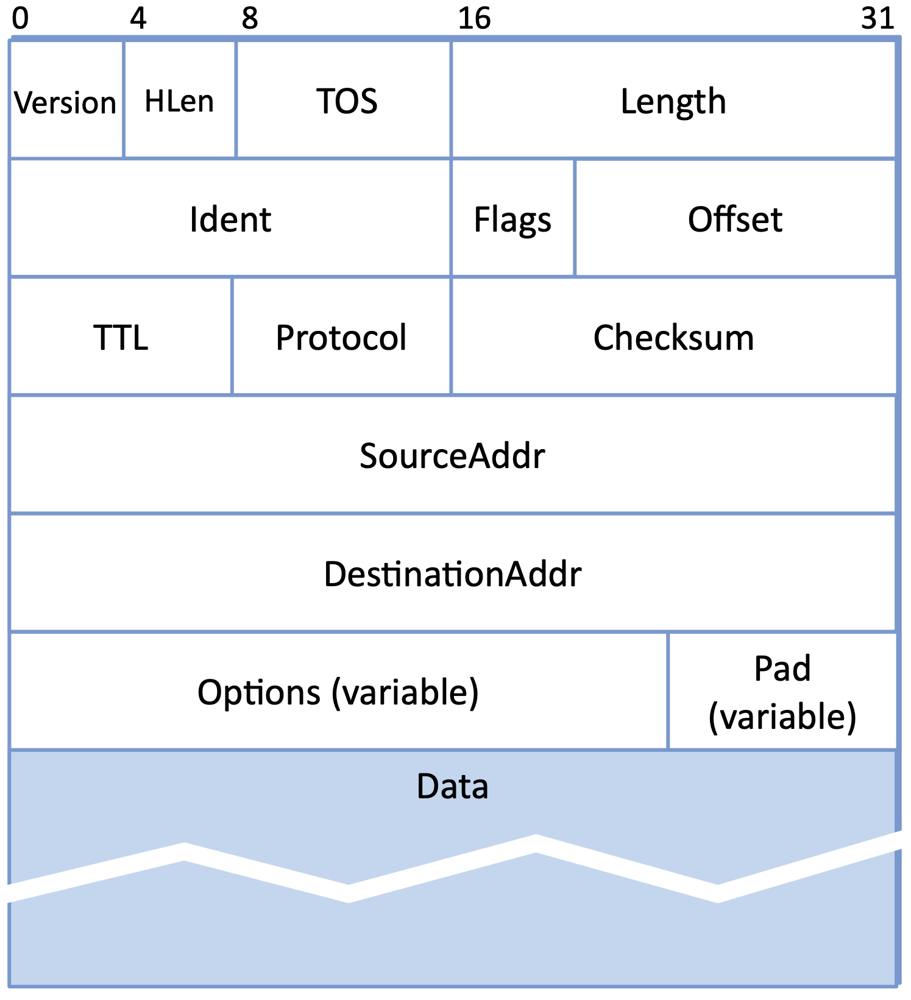
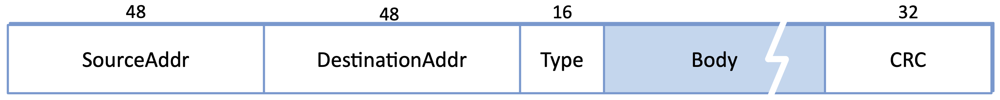
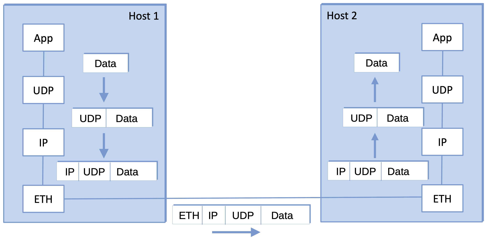

1.3  Network Protocols
------------------------------------------

Network architectures prescribe/describe a particular modularization
of the network. The challenge is to identify the collection of modules
that simultaneously provide a service that is useful in a large number
of situations, and can be efficiently implemented in the underlying
system. This is exactly what the two architectures introduced in the
previous section try to do, but before we get into the merits and
limitations of any particular architecture, let's first consider what
these "network modules" actually look like.

1.3.1 Interfaces
~~~~~~~~~~~~~~~~~~~~~~~~~~~~~~~~~

Abstractions naturally lead to layering, especially in network
systems.  The general idea is that you start with the services offered
by the underlying hardware and then add a sequence of layers, each
providing a higher (more abstract) level of service. The services
provided at the high layers are implemented using the services
provided by the low layers.

Using the Internet architecture as an example, we can imagine a simple
design with two layers of abstraction sandwiched between the
application program and the underlying network hardware, as
illustrated in :numref:`Figure %s <fig-layers>`. The layer immediately
above the hardware in this case might provide host-to-host
connectivity, abstracting away the fact that there may be an
arbitrarily complex network topology between any two hosts. (This is
what IP is designed to do in the Internet architecture.) The next
layer up builds on the available host-to-host message delivery service
and provides support for process-to-process communication channels,
abstracting away the possibility that the underlying network
occasionally loses or reorders messages. (This is what TCP and UDP are
designed to do in the Internet architecture.)

.. _fig-layers:

   Example of a layered network system.

Layering provides two useful features. First, it decomposes the
problem of building a network into more manageable components. Rather
than implementing a monolithic piece of software that does everything
you will ever want, you can implement several layers, each of which
solves one part of the problem. Second, if you decide that you want to
add some new service, you may only need to modify the functionality at
one layer, reusing the functions provided at all the other layers.

Thinking of a system as a linear sequence of layers is an
oversimplification, however. Many times there are multiple
abstractions provided at any given level of the system, each providing
a different service to the higher layers, but building on the same
low-level abstractions. We saw this in the Internet architecture
depicted in :numref:`Figure %s <fig-internet>`, where TCP and UDP
offer two different process-to-process communication services, one
making reliability guarantees (TCP) and the other not (UDP).

With this discussion of layering as a foundation, we are now ready to
discuss the modularization of a network more precisely. For starters,
the abstract objects that make up the layers of a network system are
called *protocols*. That is, a protocol provides a communication
service that higher-level objects (such as application processes, or
perhaps higher-level protocols) use to exchange messages. TCP, UDP,
and IP are all examples of Internet protocols.

Each protocol defines two different interfaces. First, it defines a
*service interface* to the other objects on the same computer that
want to use its communication services. This service interface defines
the operations that local objects can perform on the protocol. For
example, the TCP protocol supports operations by which an application
can send and receive messages. An implementation of the HTTP protocol,
for example, could support an operation to fetch a page of hypertext
from a remote server. An application such as a web browser would
invoke such an operation whenever the browser needs to obtain a new
page (e.g., when the user clicks on a link in the currently displayed
page).

Second, a protocol defines a *peer interface* to its counterpart
(peer) on another machine. This second interface defines the form and
meaning of messages exchanged between protocol peers to implement the
communication service. This would determine the way in which a
protocol on one machine communicates with its peer on another
machine. In the case of HTTP, for example, the protocol specification
defines in detail how a *GET* command is formatted, what arguments can
be used with the command, and how a web server should respond when it
receives such a command.

To summarize, a protocol defines a communication service that it exports
locally (the service interface), along with a set of rules governing the
messages that the protocol exchanges with its peer(s) to implement this
service (the peer interface). This situation is illustrated in :numref:`Figure
%s <fig-interfaces>`.

.. _fig-interfaces:

   Service interfaces and peer interfaces.

Except at the hardware level, where peers directly communicate with
each other over a physical medium, peer-to-peer communication is
indirect—each protocol communicates with its peer by passing messages
to some lower-level protocol, which in turn delivers the message to
*its* peer. And because there are potentially multiple protocols at
any given level, each providing a different communication service, we
represent the suite of protocols that make up a network system with a
*protocol graph*. The nodes of the graph correspond to protocols, and
the edges represent a *depends on* relation. For example,
:numref:`Figure %s <fig-protograph>` illustrates a protocol graph for
our Internet-inspired layered system.

.. _fig-protograph:

   Example of a protocol graph.

In this example, suppose that the file transfer program on host 1
wants to send a message to its peer on host 2 using the communication
service offered by UDP; the Internet has such a program, called TFTP.
In this case, the file application asks UDP to send the message on its
behalf. To communicate with its peer, UDP invokes the services of IP,
which invokes the services of ETH, which in turn transmits the message
to its peer on the other machine. Once the message has arrived at the
instance of IP on host 2, IP passes the message up to UDP, which in
turn delivers the message to the application. In this particular case,
the application is said to employ the services of the UDP/IP/ETH
*protocol stack*.

Note that the term *protocol* is used in two different ways. Sometimes
it refers to the abstract interfaces—that is, the operations defined
by the service interface and the form and meaning of messages
exchanged between peers, and sometimes it refers to the module that
actually implements these two interfaces. To distinguish between the
interfaces and the module that implements these interfaces, we can
refer to the former as a *protocol specification*. Specifications are
generally expressed using a combination of prose, pseudocode, state
transition diagrams, pictures of packet formats, and other abstract
notations. It should be the case that a given protocol can be
implemented in different ways by different programmers, as long as
each adheres to the specification. The challenge is ensuring that two
different implementations of the same specification can successfully
exchange messages. Two or more protocol modules that do accurately
implement a protocol specification are said to *interoperate* with
each other.

1.3.2 Encapsulation
~~~~~~~~~~~~~~~~~~~~

Consider what happens in :numref:`Figure %s <fig-protograph>` when one
of the application programs sends a message to its peer by passing the
message to UDP. From UDP’s perspective, the message it is given by the
application is an uninterpreted string of bytes. UDP does not care
that these bytes represent an array of integers, an email message, a
digital image, or whatever; it is simply charged with sending them to
its peer.  However, UDP must communicate control information to its
peer, instructing it how to handle the message when it is received.
UDP does this by attaching a *header* to the message.

Generally speaking, a header is a small data structure—from a few
bytes to a few dozen bytes—that is used among peers to communicate
with each other. As the name suggests, headers are usually attached to
the front of a message. In some cases, however, this peer-to-peer
control information is sent at the end of the message, in which case
it is called a *trailer*. The exact format for the header attached by
UDP is defined by its protocol specification. The rest of the
message—that is, the data being transmitted on behalf of the
application—is called the message’s *body* or *payload*. We say that
the application’s data is *encapsulated* in the new message created by
UDP.

To make the discussion a more concrete, :numref:`Figure %s
<fig-udphdr>`, :numref:`%s <fig-iphdr>`, and :numref:`%s <fig-ethhdr>`
depict the header for three protocols we use as running examples in
this section: UDP, IP, and Ethernet, respectively.  The examples
include two different (but common) formats for depicting protocol
headers: as a sequence of fields spread over 32-bit words (UDP and IP)
and as a sequence of fields of specified bit lengths (ETH). We'll
explain the meaning of most of these fields in later chapters, but
there is some commonality in all headers, which we describe in the
next subsection.

.. _fig-udphdr:

   UDP header specification.

.. _fig-iphdr:

   IP header specification.

.. _fig-ethhdr:

   Ethernet header specification.

Of course another possible way to document protocol headers is the
source code that implements the protocol.  For example, the following
code snippet for the UDP header is taken from the Linux kernel, where
``__be16`` and ``__sum16`` are kernel-defined types for 16-bit
unsigned integers.

.. code-block:: c

   struct udphdr {
        __be16	source;
        __be16	dest;
        __be16	len;
        __sum16	check;
   };

This process of encapsulation is then repeated at each level of the
protocol graph; for example, IP encapsulates UDP’s message by
attaching a header of its own. If we now assume that IP sends the
message to its peer over some network, then when the message arrives
at the destination host, it is processed in the opposite order: IP
first interprets the IP header at the front of the message (i.e.,
takes whatever action is appropriate given the contents of the header)
and passes the body of the message (but not the HHP header) up to UDP,
which takes whatever action is indicated by the UDP header that its
peer attached and passes the body of the message (but not the UDP
header) up to the application program. The message passed up from UDP
to the application on host 2 is exactly the same message as the
application passed down to UDP on host 1; the application does not see
any of the headers that have been attached to it to implement the
lower-level communication services. This whole process is illustrated
in :numref:`Figure %s <fig-encapsulation>`. Note that in this example,
nodes in the network (e.g., switches and routers) may inspect the IP
header at the front of the message.

.. _fig-encapsulation:

   High-level messages are encapsulated inside of low-level messages.

Note that when we say a low-level protocol does not interpret the
message it is given by some high-level protocol, we mean that it does
not know how to extract any meaning from the data contained in the
message. It is sometimes the case, however, that the low-level protocol
applies some simple transformation to the data it is given, such as to
compress or encrypt it. In this case, the protocol is transforming the
entire body of the message, including both the original application’s
data and all the headers attached to that data by higher-level
protocols.

1.3.3 Multiplexing and Demultiplexing
~~~~~~~~~~~~~~~~~~~~~~~~~~~~~~~~~~~~~~~~

Each of the protocols in :numref:`Figure %s <fig-protograph>` is
potentially asked to send and receive messages on behalf of multiple
high-level users. (Here, we use the term "user" to mean any
application or protocol that uses a protocol to deliver messages on
its behalf.) This means that in the same way we might multiplex
multiple flows of data over a single physical link, we can also think
of every protocol as multiplexing multiple user flows over a logical
connection to its peer on another machine.

Practically speaking, this simply means that the header a given
protocol attaches to its messages contains an identifier that records
the user to which the message belongs. We call this identifier a
*demultiplexing key*, or *demux key* for short. At the source host, a
protocol includes the appropriate demux key in its header. When the
message is delivered to its peer on the destination host, the peer
strips its header, examines the demux key, and demultiplexes the
message up to the correct user.

Unfortunately, there is no uniform agreement among protocols—even
those within a single network architecture—on exactly what constitutes
a demux key.  Some protocols use an 8-bit field (meaning they can
support only 256 high-level protocols), and others use 16- or 32-bit
fields. Also, some protocols have a single demultiplexing field in
their header, while others have a pair of demultiplexing fields. In
the former case, the same demux key is used on both sides of the
communication, while in the latter case, each side uses a different key
to identify the high-level protocol (or application program) to which
the message is to be delivered.

Looking back at the headers given in :numref:`Figure %s
<fig-udphdr>`, :numref:`%s <fig-iphdr>`, and :numref:`%s
<fig-ethhdr>`, IP uses the 8-bit ``Protocol`` field as its demux key,
with ``0x11`` (decimal 17) indicating the message belongs to UDP and
``0x06`` (decimal 6) indicating the message belongs to TCP. Similarly,
Ethernet uses the 16-bit ``Type`` field as its demux key, with
``0x0800`` indicating the message belongs to IP.  UDP is an example of
a protocol that uses a different demux key on each end, corresponding
to the 16-bit ``SrcPort`` and ``DstPort`` fields.
