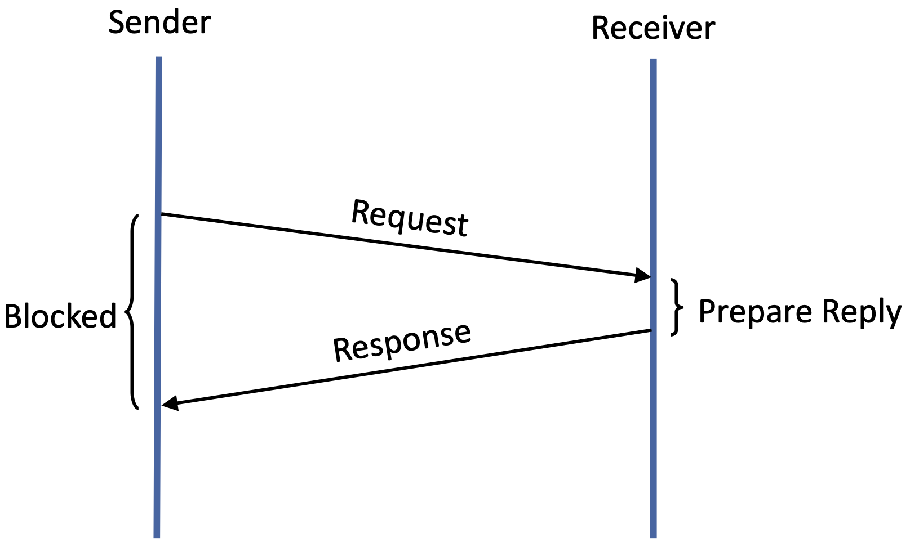

.. SPDX-FileCopyrightText: 2026 Larry L. Peterson and Bruce S. Davie
.. SPDX-License-Identifier: CC-BY-4.0

.. include:: chapters.rst

Chapter |Message|:  Message Transactions
========================================

TCP's reliable byte stream abstraction has proven to be versatile, and
able
to support a wide range of applications, but there are other
possibilities. This chapter takes a look at two of them: *Remote
Procedure Call (RPC)* and *Remote Direct Memory Access (RDMA)*.  The
two obviously share the word "Remote" in their names, which is more
than a coincidence. In both cases, the name implies an abstraction
that is already well-understood on a single machine—a procedure call
and direct memory access—has been extended to work over the network.

Less obviously, both depend on a *message transaction* to implement
their respective remote activity. That is, both implement a
request/response message exchange between a pair of processes: one
sends a request message, and the other replies with a response
message. :numref:`Figure %s <fig-rpc-timeline>` shows a common
timeline for the exchange, in which the sender blocks (suspends
execution) to wait for the reply. Message transaction protocols
sometimes support a non-blocking option, but in that case, the
protocol delivers a "completion signal" to the sender when the reply
arrives. This is a critical aspect of the transaction, because the
reply message indicates that the application process—and not just the
destination server—has received (and in some cases acted upon) the
request message.

.. _fig-rpc-timeline:

   Timeline for a request/response message transaction. The reply
   indicates the application process received (and possibly acted
   upon) the request message.

Certainly, there is nothing keeping a pair of application processes
from implementing a message transaction on top of a TCP byte stream;
we saw multiple examples in Chapter 2. But we also saw inefficiencies
in having to first establish a connection before being able to use it
for even the most trivial request/reply message exchange. Even
ignoring the RTT overhead, TCP is a complex protocol, and the time it
takes to send or receive a message adds up, impacting the latency that
applications experience.

This chapter describes an alternative approach, in which a
request/response message pair is the core transport protocol.
This has two potential advantages: (1) it's a better match for what
the application needs, making the application developer's job easier;
and (2) the implementation is simpler, resulting in better
performance.

The second advantage is the main driver of the approaches described in
this chapter, both of which focus on reducing latency for datacenter
workloads. This focus on low-latency transactions is so strong that
for much or their decades-long history, RPC and RDMA were "niche"
technologies that would not interoperable with the larger Internet.
Today, however, there is a convergence of both RPC and RDMA with the
Internet, with the goal of supporting both high-performance and the
ubiquity of Internet connectivity.

.. sidebar:: The Third Transport

   There are two well-known transport protocols in the Internet, TCP
   and UDP. The first provides a reliable byte stream, the second a
   simple multiplexing layer on top of IP. In this chapter we present
   a third transport abstraction, the request/response message
   paradigm. Whereas TCP and UDP are each defined by an RFC and are
   the standard textbook material for transport protocols, our view
   that the request/response paradigm is a third class of transport may
   be a bit unconventional. Further complicating the picture is the
   fact that RPC protocols are often layered on top of an existing
   transport, either TCP or UDP, which would lead one to think that
   RPC is some higher layer altogether. QUIC is an interesting example
   that we cover later in this chapter: almost everyone agrees it is a
   transport protocol, even as it runs over UDP for practical deployment
   reasons. It very much matches the request/response paradigm, even
   though the stated motivation was largely about improving the performance
   of web traffic in particular.

That said, the first advantage should not be overlooked.  Making the
developer's job easier often requires auxiliary components, above and
beyond the core protocol.  This includes APIs and other software
tooling. These complementary components are part of the story for both
RPC and RDMA, reinforcing one of the main lessons of Part III: that
the network edge is a robust software ecosystem, and not just one more
layer on the protocol stack.

As we will see, RPC and RDMA make different assumptions, and took
different paths to the wide-spread adoption they enjoy today.  Because
they represent such different approaches, they make for an interesting
comparative case study. But just as importantly, they both have the
potential to become the dominant transport protocol for their target
application workloads.

.. Make a bigger deal about datacenter use cases, especially wrt
   supporting AI.

   Case study: RPC is "Useful -> Fast" & RDMA is "Narrow -> General".

.. include:: message/design.rst
.. include:: message/rpc.rst
.. include:: message/quic.rst
.. include:: message/rdma.rst
.. include:: message/roce.rst
.. include:: message/arguments.rst

