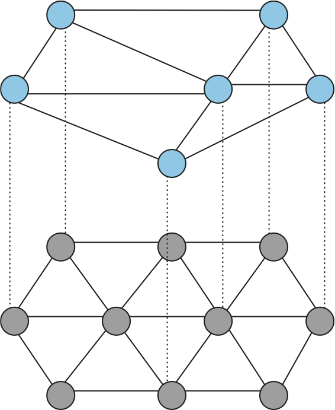

.. SPDX-FileCopyrightText: 2019 Systems Approach LLC
.. SPDX-FileCopyrightText: 2025 Systems Approach LLC
.. SPDX-License-Identifier: CC-BY-4.0

.. include:: chapters.rst

Chapter |Overlay|: Overlay Networks
=====================================

An overlay is a logical network implemented on top of some underlying
network. By this definition, the Internet started out as an overlay
network; a packet-switched network implemented on top of the circuits
provided by the old telephone network. Eventually those links from the
telephone network were replaced with point-to-point links directly
connecting the backbone routers. The Internet itself became the
foundational network on top of which new overlays could be built.

:numref:`Figure %s <fig-overlay-net>` depicts an overlay implemented
on top of an underlying network. Each node in the overlay also exists
in the underlying network; it processes and forwards packets in an
application-specific way. The links that connect the overlay nodes are
implemented as logical links (e.g., tunnels) through the underlying
network.

.. _fig-overlay-net:

   Overlay network layered on top of a physical network.

   

We explored one common use of overlay networks in Chapter |Virt|,
using tunnels to build virtual networks. In this chapter we move our
focus to overlays that implement application-specific
behavior. Content distribution networks have had a substantial impact
on the way the Internet scales and performs. They can now be viewed as
an indispensible part of the Internet's infrastructure, even though
they are technically implemented as overlays. Similarly, the ubiquity
of video conferencing applications such as Zoom has been possible only
because of the investments in overlays made by the developers of
conferencing systems. 

.. include:: overlay/design.rst
.. include:: overlay/CDN.rst
.. include:: overlay/conference.rst
