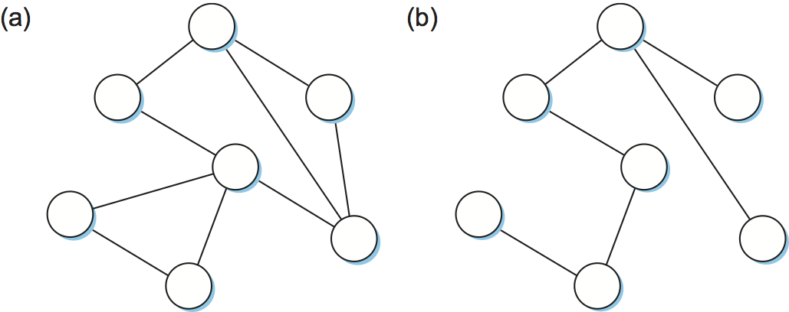

4.2 Spanning Tree Protocol
---------------------------

The history of Ethernet switching goes back a long way, with the
earliest switches being referred to as "bridges" because they just
connected together a couple of ethernet segments. In its simplest
form, a bridge would receive packets on one port and copy them out to
its other port or ports, effectively broadcasting packets from one
segment to another. Over time, a bridge could "learn" which hosts were
reachable on on which port by watching the source addresses of
received packets, so a "learning bridge" would not waste resources
forwarding a packet onto a port that didn't lead to the destination.

Learning bridges are fine until the network has a loop in it, in which
case they fail badly—frames potentially get forwarded forever. The
problem with looping packets is that they consume resources: switch
capacity and link capacity. This is particularly bad in the case of
Ethernet which has no way to tell when a packet is circulating in a
loop. (The Internet Protocol does have such a mechanism, although
loops remain undesirable). Consider the example depicted in
:numref:`Figure %s <fig-elan3>`, where switches S1, S4, and S6 form
a loop.

.. _fig-elan3:
.. figure:: routing/figures/Slide5.png
   :width: 500px
   :align: center

   Switched Ethernet with loops.

In our example switched network, suppose that a packet addressed to
Host A enters switch S4
from Host C and that the destination address (Host A) has never been
seen before on this network. So that address is not yet in any
switch's forwarding table: S4 sends a copy of the packet out its two
other ports: to switches S1 and S6. Switch S6 forwards the packet onto
S1 (and meanwhile, S1 forwards the packet onto S6), both of which in
turn forward their packets back to S4. Switch S4 still doesn’t have this
destination in its table, so it forwards the packet out its two other
ports. There is nothing to stop this cycle from repeating endlessly,
with packets looping in both directions among S1, S4, and S6.

Why would a switched Ethernet (or extended LAN) come to have a loop in
it? One possibility is that the network is managed by more than one
administrator, for example, because it spans multiple departments in an
organization. In such a setting, it is possible that no single person
knows the entire configuration of the network, meaning that a switch
that closes a loop might be added without anyone knowing. A second, more
likely scenario is that loops are built into the network on purpose—to
provide redundancy in case of failure. After all, a network with no
loops needs only one link failure to become split into two separate
partitions.

Whatever the cause, switches must be able to correctly handle loops.
This problem is addressed by having the switches run a distributed
*spanning tree* algorithm. If you think of the network as being
represented by a graph that possibly has loops (cycles), then a
spanning tree is a subgraph of this graph that covers (spans) all the
vertices but contains no cycles. That is, a spanning tree keeps all of
the vertices of the original graph but throws out some of the
edges. For example, :numref:`Figure %s <fig-graphs>` shows a cyclic
graph on the left and one of possibly many spanning trees on the
right.

.. _fig-graphs:

   Example of (a) a cyclic graph; (b) a corresponding spanning
   tree.

The idea of a spanning tree is simple enough: it’s a subset of the
actual network topology that has no loops and that reaches all the
devices in the network. The hard part is the distributed algorithm:
how all of the switches coordinate their decisions to arrive at a
single view of the spanning tree. After all, one topology is typically
able to be covered by multiple spanning trees. The answer lies in the
spanning tree protocol, which we’ll describe now.

The spanning tree algorithm, which was developed by Radia Perlman, then
at the Digital Equipment Corporation, is a protocol used by a set of
switches to agree upon a spanning tree for a particular network. (The
IEEE 802.1 specification is based on this algorithm.) In practice, this
means that each switch decides the ports over which it is and is not
willing to forward frames. In a sense, it is by removing ports from the
topology that the network is reduced to an acyclic tree. It is even
possible that an entire switch will not participate in forwarding
frames, which seems kind of strange at first glance. The algorithm is
dynamic, however, meaning that the switches are always prepared to
reconfigure themselves into a new spanning tree should some switch fail,
and so those unused ports and switches provide the redundant capacity
needed to recover from failures.

The main idea of the spanning tree is for the switches to select the
ports over which they will forward frames. The algorithm selects ports
as follows. Each switch has a unique identifier; for our purposes, we
use the labels S1, S2, S3, and so on. The algorithm first elects the
switch with the smallest ID as the root of the spanning tree; exactly
how this election takes place is described below. The root switch always
forwards frames out over all of its ports. Next, each switch computes
the shortest path to the root and notes which of its ports is on this
path. This port is also selected as the switch’s preferred path to the
root. Finally, to account for the possibility there could be another
switch connected to its ports, the switch elects a single *designated*
switch that will be responsible for forwarding frames toward the root.
Each designated switch is the one that is closest to the root. If two or
more switches are equally close to the root, then the switches’
identifiers are used to break ties, and the smallest ID wins. Of course,
each switch might be connected to more than one other switch, so it
participates in the election of a designated switch for each such port.
In effect, this means that each switch decides if it is the designated
switch relative to each of its ports. The switch forwards frames over
those ports for which it is the designated switch.

.. _fig-elan4:
.. figure:: figures/impl/Slide6.png
   :width: 500px
   :align: center

   Spanning tree with some ports not selected.

:numref:`Figure %s <fig-elan4>` shows the spanning tree that
corresponds to the network shown in :numref:`Figure %s
<fig-elan3>`. In this example, S1 is the root, since it has the
smallest ID. Notice that S3 and S5 are connected to each other, but S5
is the designated switch since it is closer to the root. Similarly, S5
and S7 are connected to each other, but in this case S5 is the
designated switch since it has the smaller ID; both are an equal
distance from S1.

While it is possible for a human to look at the network given in
:numref:`Figure %s <fig-elan3>` and to compute the spanning tree given
in the :numref:`Figure %s <fig-elan4>` according to the rules given
above, the switches do not have the luxury of being able to see the
topology of the entire network, let alone peek inside other switches
to see their ID. Instead, they have to exchange configuration messages
with each other and then decide whether or not they are the root or a
designated switch based on these messages.

Specifically, the configuration messages contain three pieces of
information:

1. The ID for the switch that is sending the message.

2. The ID for what the sending switch believes to be the root switch.

3. The distance, measured in hops, from the sending switch to the root
   switch.

Each switch records the current *best* configuration message it has seen
on each of its ports (“best” is defined below), including both messages
it has received from other switches and messages that it has itself
transmitted.

Initially, each switch thinks it is the root, and so it sends a
configuration message out on each of its ports identifying itself as the
root and giving a distance to the root of 0. Upon receiving a
configuration message over a particular port, the switch checks to see
if that new message is better than the current best configuration
message recorded for that port. The new configuration message is
considered *better* than the currently recorded information if any of
the following is true:

-  It identifies a root with a smaller ID.

-  It identifies a root with an equal ID but with a shorter distance.

-  The root ID and distance are equal, but the sending switch has a
   smaller ID

If the new message is better than the currently recorded information,
the switch discards the old information and saves the new information.
However, it first adds 1 to the distance-to-root field since the switch
is one hop farther away from the root than the switch that sent the
message.

When a switch receives a configuration message indicating that it is not
the root—that is, a message from a switch with a smaller ID—the switch
stops generating configuration messages on its own and instead only
forwards configuration messages from other switches, after first adding
1 to the distance field. Likewise, when a switch receives a
configuration message that indicates it is not the designated switch for
that port—that is, a message from a switch that is closer to the root or
equally far from the root but with a smaller ID—the switch stops sending
configuration messages over that port. Thus, when the system stabilizes,
only the root switch is still generating configuration messages, and the
other switches are forwarding these messages only over ports for which
they are the designated switch. At this point, a spanning tree has been
built, and all the switches are in agreement on which ports are in use
for the spanning tree. Only those ports may be used for forwarding data
packets.

Let’s see how this works with an example. Consider what would happen in
:numref:`Figure %s <fig-elan4>` if the power had just been restored to a campus,
so that all the switches boot at about the same time. All the switches
would start off by claiming to be the root. We denote a configuration
message from node X in which it claims to be distance d from root node Y
as (Y,d,X). Focusing on the activity at S3, a sequence of events would
unfold as follows:

1. S3 receives (S2, 0, S2).

2. Since 2 < 3, S3 accepts S2 as root.

3. S3 adds one to the distance advertised by S2 (0) and thus sends
   (S2, 1, S3) toward S5.

4. Meanwhile, S2 accepts S1 as root because it has the lower ID, and it
   sends (S1, 1, S2) toward S3.

5. S5 accepts S1 as root and sends (S1, 1, S5) toward S3.

6. S3 accepts S1 as root, and it notes that both S2 and S5 are closer to
   the root than it is, but S2 has the smaller id, so it remains on S3’s
   path to the root.

This leaves S3 with active ports as shown in :numref:`Figure %s <fig-elan4>`.
Note that Hosts A and B are not able to communicate over the shortest
path (via S5) because frames have to “flow up the tree and back down,”
but that’s the price you pay to avoid loops.

Even after the system has stabilized, the root switch continues to send
configuration messages periodically, and the other switches continue to
forward these messages as just described. Should a particular switch
fail, the downstream switches will not receive these configuration
messages, and after waiting a specified period of time they will once
again claim to be the root, and the algorithm will kick in again to
elect a new root and new designated switches.

One important thing to notice is that although the algorithm is able
to reconfigure the spanning tree whenever a switch fails, there is
always (at most) a single path between any two points on the tree,
thus avoiding loops.  And because there is only one path between two
points, there is no option to spread traffic across multiple paths to
reduce congestion or take advantage of extra capacity.
